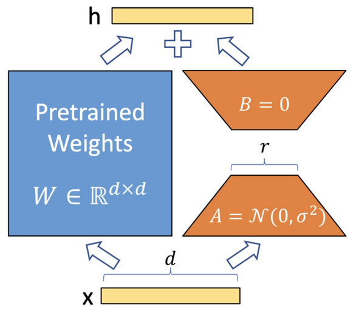
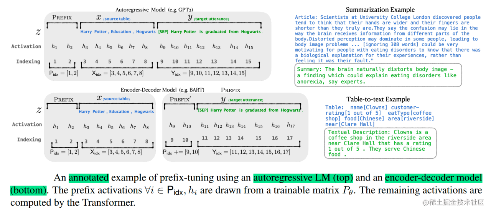
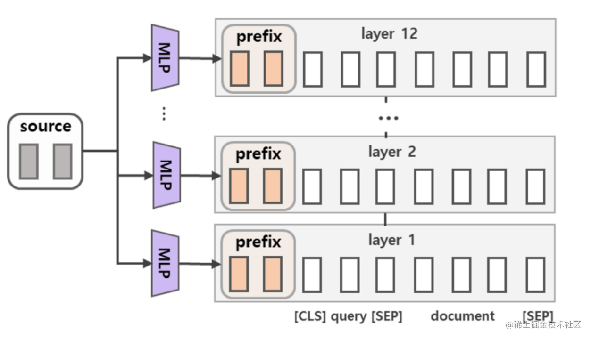

## 微调

### 微调一个模型的流程
收集数据 $\rightarrow$ 数据处理/清洗 $\rightarrow$ 选择合适模型/loss $\rightarrow$ 添加特定任务头层 $\rightarrow$ 冻结部分参数 $\rightarrow$ 设定超参数 $\rightarrow$ 模型训练 $\rightarrow$ 模型评估

## LoRA 微调



**核心思想:** 参数优化量可以是低秩的，映射到低维空间下也能保持性能
**实现手段:** 冻结 W，增加一个旁路，采用残差的方式更新参数

### LoRA 的参数及作用

#### 低秩矩阵秩（Rank r）

- **作用**：r 是低秩矩阵的秩，控制了模型微调时调整的参数量。秩越高，模型的表示能力越强，但微调的参数量也越大；秩越低，微调的参数量越少，但表达能力可能会受到限制。
- **设置**：在实践中，秩通常是一个小的超参数，可能设置为 8、16 或 32 等，具体取决于微调任务的要求和硬件的限制。

#### 缩放因子（Scaling Factor）

- **作用**：在 LoRA 中，A 和 B 矩阵的输出需要乘上一个缩放因子（通常为一个超参数），以控制 LoRA 添加的偏移量大小。这个因子有助于控制 LoRA 的影响力，避免它对原始模型参数的改变过大。
- **设置**：一般会通过交叉验证或实验来选择合适的缩放因子，常见的设置值是 1 或其他小的正数。

#### 注意力层的 LoRA 适配（LoRA in Attention Layers）

LoRA 在应用到 Transformer 类模型（如 GPT 或 BERT）时，常常针对注意力层（Attention layers）进行微调。Transformer 的注意力机制涉及矩阵乘法操作，LoRA 可以通过添加低秩矩阵来调整这些矩阵。

- **作用**：在注意力机制中，LoRA 通过对查询（Query）、键（Key）和值（Value）的权重矩阵进行低秩调整，来使模型在处理任务时能够更好地适应特定的任务或领域。
- **设置**：LoRA 主要适用于 Transformer 的注意力层，尤其是 Q 和 K 的权重矩阵。

#### 矩阵初始化方式

- **作用**：确定低秩矩阵的初始化方式。具体来说，`fan_in_fan_out` 控制低秩矩阵 A 和 B 的初始化方式，通常采用 Xavier 初始化（或 Glorot 初始化）。该参数是通过控制权重矩阵的“输入输出”进行初始化，优化网络的学习效率。
- **设置**：通常根据模型的需要设置为 `True` 或 `False`，以决定如何初始化低秩矩阵。

```python
lora_config = LoRAConfig(
    r=8,                         # 低秩矩阵的秩
    lora_alpha=32,               # 缩放因子
    lora_dropout=0.1,            # LoRA 层的 dropout 比例
    enabled=True,                # 启用 LoRA 微调
    target_modules=["q_proj", "k_proj", "v_proj"],  # 选择要应用 LoRA 的层
    fan_in_fan_out=True          # 是否采用 fan-in-fan-out 初始化
)
```
> r 过小：可以减少显存和计算开销，提高效率。降维空间太小，可能不足以捕捉下游任务的特定特征，导致模型表达能力不足，微调效果较差。
r 过大：能够捕捉更复杂的特征，理论上模型的性能可能提升。如果任务本身较简单，使用过高的 `r` 会导致过拟合。
λ 过小：微调权重 $\Delta W$​ 的影响被弱化，模型主干部分权重保持稳定，有助于避免训练初期的不稳定。但会导致LoRA 学到的特征贡献过低，模型难以适应下游任务。
λ 过大：显著增加 $\Delta W$ 对模型的影响力，可能快速适配复杂任务。破坏预训练模型的已有能力，导致模型生成质量下降或任务性能不稳定。更容易发生梯度爆炸。

## Prefix Tuning

每层插入可学习前缀向量，随机初始化，然后用MLP来得到prefix embedding

- 针对自回归架构模型：在句子前面添加前缀，得到 `z = [PREFIX; x; y]`，合适的上文能够在固定 LM 的情况下去引导生成下文（比如：GPT3的上下文学习）。
- 针对编码器-解码器架构模型：Encoder和Decoder都增加了前缀，得到 `z = [PREFIX; x; PREFIX0; y]`。**Encoder端增加前缀是为了引导输入部分的编码，Decoder 端增加前缀是为了引导后续token的生成。**





**更高表达能力**：前缀向量直接干预每一层注意力机制，比 Prompt-tuning 更有效。
**轻量化**：仍然保持模型参数冻结，仅优化前缀向量。
**灵活性强**：适用于更复杂的下游任务。

## Prompt Tuning

Prompt 的形式通常分为两类：
- **Hard Prompt（硬提示）**：通过自然语言手工设计的文本提示。
    - 优点：直观、简单。
    - 缺点：人工设计的 Prompt 效果不一定最优，可能需要反复调整。
- **Soft Prompt（软提示）**：通过优化可学习的嵌入向量，作为 Prompt 的一部分。
    - 优点：无需人工干预，优化过程自动寻找最佳提示。
    - 缺点：需要训练一些额外参数，难以直接解释。

输入前添加可学习的离散或连续的 Prompt（提示），让 LLM 通过这些提示完成任务。这些 Prompt 参数是固定长度的嵌入向量，作为输入直接优化。目标是找到一个最优的 Prompt，让模型能更好地适应特定任务，而无需改变模型的参数
$$
[Prompt(\theta)] + \text{Task Input} \rightarrow \text{LLM}_{Output}
$$
**简单易用**：无需修改预训练模型，只需优化 Prompt 的参数。
**轻量化**：微调的参数量少，非常适合处理大规模模型。
**适用性强**：在少样本（few-shot）学习中表现较好。

## P-Tuning(Prompt Tuning-v2)

P-tuning（Prompt tuning v2 的进化版本）提出在 Prompt 中使用更复杂的架构（如 LSTM 或深层 Transformer），用以生成动态的 Prompt 嵌入。

动态的 Prompt 嵌入**可以根据具体输入内容生成任务相关的提示**，比固定向量更有表达力。
$$
[Dynamic Prompt(θ)] + \text{Task Input} → \text{LLM}_{Output}
$$

**动态提示**：生成输入相关的 Prompt，适用于任务多样性较高的场景。
**更强泛化能力**：适合更复杂的任务和跨任务的场景。
**效果更好**：在大规模模型上，性能优于 Prompt-tuning 和 Prefix-tuning。

| **方法**          | **核心思想**                             | **优化参数量**       | **适用场景**                   | **优点**                 | **缺点**                     |
| ----------------- | ---------------------------------------- | -------------------- | ------------------------------ | ------------------------ | ---------------------------- |
| **Prompt-tuning** | 可学习的固定长度输入提示                 | 极小（输入层）       | 简单任务、少样本场景           | 简单易用、轻量化         | 表达能力受限，复杂任务效果差 |
| **Prefix-tuning** | 每层插入可学习的前缀向量                 | 较少（每层）         | 复杂任务、对准确率要求高的场景 | 灵活性强，适合多任务     | 参数量比 Prompt-tuning 多    |
| **P**-**tuning**  | 动态生成 Prompt 嵌入，结合上下文优化提示 | 中等（额外网络参数） | 跨任务、多样性任务             | 表达能力强，泛化能力更好 | 增加计算复杂度和训练难度     |

## SFT 模型的 loss 是怎么计算的？怎么确保只计算该部分的 loss

在 SFT 中，通常采用的是交叉熵损失

确保损失只涉及模型的某些特定部分，避免更新整个模型的权重，为此，通常采取以下策略：

1. 冻结部分模型参数
2. 通过损失函数选择性计算：只计算计算lora_output于target的loss，然后只反向传播这个loss
3. 动态学习率调整：不同模块学习率不同

```python
optimizer = torch.optim.AdamW([
    {'params': model.base.parameters(), 'lr': 1e-5},  # 冻结部分的学习率较小
    {'params': model.lora.parameters(), 'lr': 1e-4},  # LoRA 层的学习率较大
])
```
